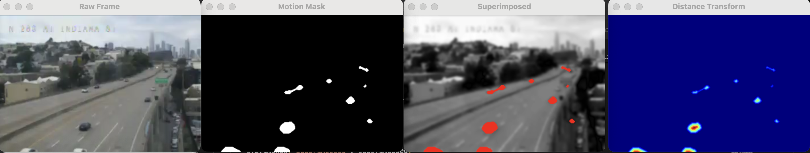

Tried just YOLO (`yolo-initial-tests/`), but doesn't quite work. Mostly, these images are just too low-resolution. You're not tracking cars, you're tracking moving dots.


What if we were to just track moving pixels? The cameras are stationary. To make more robust:

Blur very slightly to eliminate noise, run sobel operator, compare to previous frame. Moving cars should be high-change areas from frame-to-frame. If the cars aren't moving... well you're cooked. Let's give it a try.

I've managed to obtain the streaming URL and use ffmpeg to grab 30 seconds.

```bash
ffmpeg -i "https://wzmedia.dot.ca.gov/D4/S280_on_Monterey_Bl.stream/playlist.m3u8" -t 30 -c:v libx264 -c:a aac output.mp4
```

Hmm. This strategy seems promising but it still needs some cleaning up. Current state:


This is going to be very meta, but most errors currently stem from things flashing and then dissapearing, like the image shifting. So we store diff of diffs and only keep the ones in common.

Well, it turns out that opencv has exactly what we're trying to do built in. The problem of detecting moving objects over a static background is not new. So, I just used `createBackgroundSubtractorMOG2`. And it works brilliantly! Brilliantly in comparison, at least.


Now it's a matter of tuning the parameters so it works well.

We have extra time on this project. I'm considering chopping five-second videos and labeling car masks at the end, then integrating over MOG2 and comparing to ground-truth masks. Then, I can just throw this through [Optuna](https://optuna.org/), since that works on any black-box metric. I did a similar thing to determine morphological parameters for a different computer vision project. It's not perfect, but it's something.

TIme to start a new experiment in `mog2-morphological-optimization/`.

I've automated scraping in `get_videos.py`. Then, I just spent a bit of time in GIMP to label a few image masks. Then I let optuna run! (`main.py`)

I'm just optimizing for MSE on masks. I sure hope it won't just collapse to all zeros.



So it works decently well! The farther-away cars aren't doing as well, but that's technically okay-ish.

Here's my brilliant idea to make scale-invariant morphology: - Use aggressive erosion - Get distance transform maxima - Use maxima as a proxy for depth (nearest-neighbor filling in) - Adjust kernel size based on "depth"

---

Yeah so that's not worth it and it will just prevent the real erosion.

Spoke with Wes. Application ideas:

Traffic vs time of day

What % of people are speeding??
Average speed / time of day

Cost/benefit analysis

Highway safety: How often do people speed??

With regard to the blobs / shadow detection, there's not much I can do; What I have right now is good enough™. With some more erosion, we can basically get centroids.

But wait-- let's think. If we were able to suppress shadows, that's most of the overlap problem solved. Overlap isn't due to actually too much overlap, it's just because of long shadows overlapping.

21 Nov 2025

Yeah, so shadow suppression isn't working.

I spent a good amount of time restructuring the code. And I have an idea for shadow suppression using LAB thresholing on the fg mask.

3 dec 2025
Implemented a rudimentary car timeseries tracking in subdirectory `timeseries-tracking`.
Talked with wes about this insane algorithm strategy to cope with blobs. Basically, you have a blob class and you update a list of blobs. Each blob has an x,y,+ delta vector. So you see. If there are pixels in the next frame's mask of where that blob is + the delta vector, then update the blob to be the intersection there. That way if the next thing is bigger it still works. Conversely, if blob is split down the line, then split it. Then always use these processed blobs to look at the next frame, and the next.


5 dec 2025

So I did that basically and it worked (pretty well!) I guess now time to see what I want to do with that. Let's see how to track speeding and do it for an extended period (livestreams currently kind of drop 🥶)

Let's see... 

A car is 4.5 m long according to google™. 

Dimensional analysis: https://www.desmos.com/calculator/lz3zqirmao