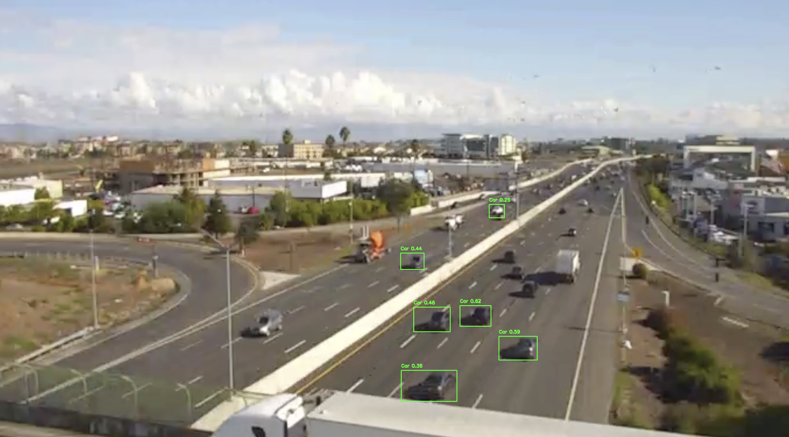
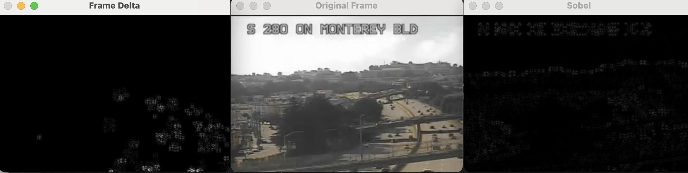
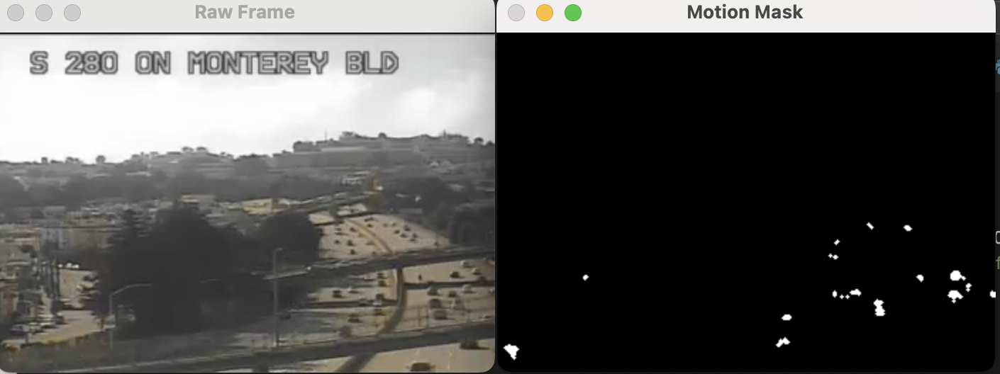

Tried just YOLO (`yolo-initial-tests/`), but doesn't quite work. Mostly, these images are just too low-resolution. You're not tracking cars, you're tracking moving dots.



What if we were to just track moving pixels? The cameras are stationary. To make more robust:

Blur very slightly to eliminate noise, run sobel operator, compare to previous frame. Moving cars should be high-change areas from frame-to-frame. If the cars aren't moving... well you're cooked. Let's give it a try.

I've managed to obtain the streaming URL and use ffmpeg to grab 30 seconds. 
```bash
ffmpeg -i "https://wzmedia.dot.ca.gov/D4/S280_on_Monterey_Bl.stream/playlist.m3u8" -t 30 -c:v libx264 -c:a aac output.mp4
```

Hmm. This strategy seems promising but it still needs some cleaning up. Current state: 




This is going to be very meta, but most errors currently stem from things flashing and then dissapearing, like the image shifting. So we store diff of diffs and only keep the ones in common.


Well, it turns out that opencv has exactly what we're trying to do built in. The problem of detecting moving objects over a static background is not new. So, I just used `createBackgroundSubtractorMOG2`. And it works brilliantly! Brilliantly in comparison, at least.



Now it's a matter of tuning the parameters so it works well. 

We have extra time on this project. I'm considering chopping five-second videos and labeling car masks at the end, then integrating over MOG2 and comparing to ground-truth masks. Then, I can just throw this through [Optuna](https://optuna.org/), since that works on any black-box metric. I did a similar thing to determine morphological parameters for a different computer vision project. It's not perfect, but it's something. 

TIme to start a new experiment in `mog2-morphological-optimization/`.

I've automated scraping in `get_videos.py`. Then, I just spent a bit of time in GIMP to label a few image masks. Then I let optuna run! (`main.py`)

I'm just optimizing for MSE on masks. I sure hope it won't just collapse to all zeros. 