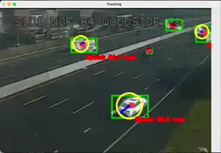
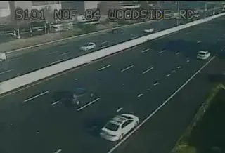

# car tracking

Project goal: Attempt to count / determine other statistics using the [california traffic cameras](https://cwwp2.dot.ca.gov/vm/iframemap.htm)

<table width="100%">
    <tr>
        <td width="50%">
            
        </td>
        <td width="50%">
            
        </td>
    </tr>
</table>

I've documented my process extensively in [NOTES.md](NOTES.md). Overall, this project has several subfolders, each one corresponding to a stage of the project at which I made critical components. Code is duplicated between subfolders-- This is so that each might be self-contained whilst still exhibiting the different components. If you're less interested in the process, final code is at [timeseries-tracking](timeseries-tracking).

- Final algorithmic structure:
    - YOLO doesn't work on these low-resolution images. In order to reliably track cars, we need something else. Finetuning YOLO on these data might work, but it's computationally expensive, time-consuming, and might not improve much (YOLO is already good at what it does, training it to track cars won't make it better at tracking cars beyond how good it is). In fact, these cars are so small (as small as a few dozen pixels) that I doubt any NN-based detection framework would work reliably through the noise of such aggressive video compression. But there is a domain-specific detector that's dead-simple that would. Movement detection. After all, in these videos, the cars move and the background doesn't. I used [Optuna](https://optuna.org/) to automatically tune MOG2 parameters (and post-processing morphological coeficients) using a very small [volume of data](mog2-morphological-optimization/data) that I[automatically scraped](mog2-morphological-optimization/get_videos.py) and then labelled with GIMP. 
    - After iterating on this system until I was able to reliably mask cars, there's a second big problem to face. Occlusion. I empirically discovered that it's mostly impossible to reliably suppress shadows (*after all, how do you programmatically distinguish between a shadow and a black car without explicitly encoding the shape of the car?*), so this means that cars often overlap (because a shadow might touch a car in the next lane). This means that greedily picking the blob with the closest pixel coordinates the next frame isn't going to cut it. Instead, I keep track of every detection and take advantage of the fact that cars mostly don't change direction when driving to track blobs, even when they merge or split, using a frame horizon of only 1. 

If you plan on understanding the code and looking through it, I reccommend you jump straight to the [speed-tracking](speed-tracking) subdirectory (where all the final code is stored). 
- File structure
    - `get_videos.py`: scraping logic, URLs list
    - `mog2_pipeline.py`: Algorithm logic cars from the video stream using MOG2. 
    - `run_optuna.py`: Orchestration code to run optuna to find the best morphological parameters. Best parameters are stored in `best.txt`.
    - `track_over_time.py`: Car tracking + speed tracking logic, main demo entry point.
    - `data`: Data. Samples are uniquely identified by UUID. There's a video, an image, and a mask image in `data/masks/{uuid}.png`

<!-- https://github.com/user-attachments/assets/109d3529-cd21-4093-b0df-d841a5fc4fb7

https://github.com/user-attachments/assets/253715f1-9b38-43b9-beb4-6a1afa8b5014 -->

<!--  XX https://github.com/user-attachments/assets/3e3327ac-35e9-470f-85f9-3c12449f6db7 -->

