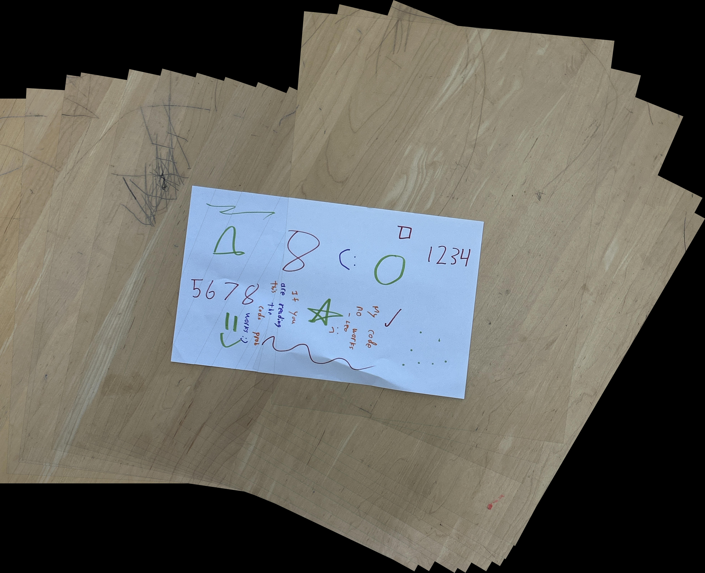
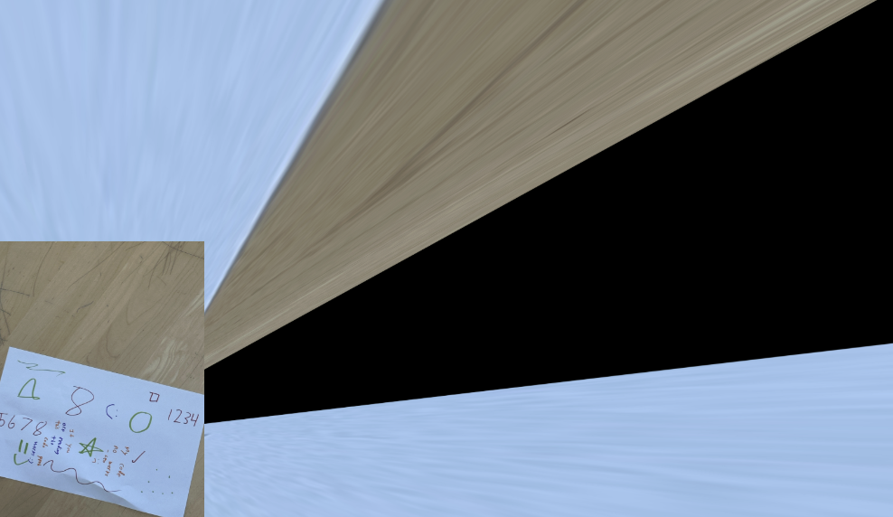

# Panorama Stitching

 

Welcome to the subfolder! You'll find development notes in NOTES.md and code in the python files. `uv run main.py` to stitch everything together and output results at `stitched_full.jpg`. 

Most of the underlying logic is located in `stitch_two_images.py` (after all, it's easy to stitch lots of images together once you can stitch two). 

Keypoints used for tracking should be outputted at `keypoints.png` when you run `stitch_two_images.py`

Source images are located in `images/`. `sample_imgs/` is for feature descriptor testing purposes.

`images-failure-case` show images which don't produce good results when using the custom RANSAC implementation, giving nonsense results for the computed homography matrix. I'm not quite sure why...

> 

Algorithm works as such:

- Identity keypoints in each image
- Obtain feature descriptor for each keypoint
- Use RANSAC algorithm to correlate points with similar feature descriptors and obtain projection matrix H
- Apply H to stitch the two images together.
